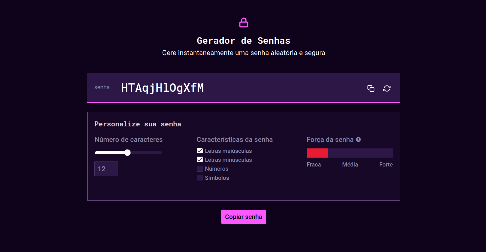

# Gerador de Senhas
## Introdução
Bem-vindo à documentação do projeto Gerador de Senhas, desenvolvido como parte do processo seletivo para a posição de Pessoa Desenvolvedora *Front-End* na Alura. Este projeto visa fornecer uma ferramenta intuitiva e eficiente para a criação de senhas seguras, com funcionalidades adaptáveis e uma interface amigável.

Nesta documentação, você encontrará detalhes sobre a estrutura do projeto, as tecnologias utilizadas, e as práticas adotadas durante o desenvolvimento. O objetivo é apresentar uma visão geral do *design* e da funcionalidade da aplicação, bem como uma reflexão acerca das melhorias que podem ser realizadas futuramente.

<!-- TODO: colocar descrição da imagem -->



## Índice

- [Introdução](#introdução)
- [Instalação](#instalação)
- [Estratégias de Desenvolvimento](#estratégias-de-desenvolvimento)
    - [SASS](#sass)
    - [JavaScript](#javascript)
    - [Acessibilidade](#acessibilidade)
    - [Testes](#testes)
    - [CI/CD](#cicd)
- [Reflexões e Melhorias](#reflexões-e-melhorias)
- [Conclusão](#conclusão)


## Instalação

Para executar este projeto é necessário executar o Sass, a fim de compilar o CSS. Para isso, utilize o seguinte comando:

```
sass src/assets/stylesheets/index.scss build/stylesheets/index.css --watch
```

Entretanto, não é necessário executar o Sass para visualizar o projeto, uma vez que ele está disponível no seguinte link: [https://unzerstort.github.io/gerador-senhas/](https://unzerstort.github.io/gerador-senhas/).

Já para a execução dos testes, é necessário utilizar o comando abaixo:

```
node src/tests
```

Este projeto utilizou:
* NodeJS na versão `18.20.2` (utilizado apenas na execução dos testes);
* Selenium na versão `4.24.0`;
* Mocha na versão `10.7.3` (utilizado em conjunto com o Selenium);
* Sass na versão `1.77.8`.
* Durante o desenvolvimento, utilizei a extensão [Live Server para o VSCode](https://marketplace.visualstudio.com/items?itemName=ritwickdey.LiveServer) para constantemente atualizar a aplicação no navegador.


## Estratégias de Desenvolvimento
### Sass

Ao iniciar o projeto, optei por utilizar o pré-processador de CSS Sass devido às suas funcionalidades avançadas, como aninhamento de regras de estilo, variáveis e *partials*, que são essenciais para a modularização do código.

Para garantir um CSS com alto grau de abstração, reutilização e composição de classes, adotei uma abordagem híbrida. As classes que não requerem *media queries* e que podem ser facilmente compostas, como `bg-dark-violet` e `border`, seguem a metodologia *utility-first*. Essa abordagem promove a reutilização e reduz a complexidade do código.

Por outro lado, para estruturas que exigem maior controle e adaptação a diferentes tamanhos de tela, utilizei classes nomeadas de forma convencional, aplicando as modificações necessárias por meio de *media queries*. Essa estratégia permite um controle mais refinado sobre o layout e a responsividade do projeto.

### JavaScript 

Para garantir um princípio da responsabilidade única modularizei o código javascript através dos ECMAScript Modules. Cada componente e suas lógicas são definidas em um arquivo próprio, sendo unificados no `index.js`, que espera o total carregamento do DOM da página HTML para tanto inicializar os inputs, quanto para ativar seus eventos/interatividade com o usuário.


### Acessibilidade

Com o objetivo de aprimorar a experiência do usuário e garantir que a aplicação seja acessível e inclusiva para todos, independentemente de suas habilidades ou limitações, a acessibilidade foi uma das preocupações durante o desenvolvimento.

Seguindo as Diretrizes de Acessibilidade para Conteúdo Web (WCAG) 2.2, implementei uma série de práticas recomendadas, incluindo o uso de atributos ARIA (*Accessible Rich Internet Applications*). Esses atributos, como `aria-describedby`, `aria-labelledby` e `aria-hidden`, são fundamentais para complementar o HTML e melhorar a interação da aplicação com tecnologias assistivas.

Além da implementação do ARIA, adotei HTML semântico para estruturar a aplicação de maneira clara e intuitiva. Tags HTML apropriadas foram utilizadas para criar componentes que são mais facilmente compreendidos por ferramentas como leitores de tela, garantindo uma navegação e uma experiência de uso mais fluídas.

A navegação através do teclado também foi uma prioridade, pois beneficia não apenas usuários com deficiências motoras ou visuais, mas também aqueles que preferem essa forma de interação. Isso garante que a aplicação seja acessível e eficiente para um público mais amplo.


### Testes

Para escolher os testes a serem utilizados, optei por uma abordagem de *Test-Driven Development* (TDD) com testes *end-to-end*. Essa escolha visa garantir que eu possa refatorar o código com confiança em um nível mais elevado. Portanto, optei por essa metodologia em vez de utilizar apenas testes unitários. Para a execução dos testes, selecionei o Selenium, que é eficaz na simulação das interações do usuário.

Normalmente, eu incorporo tanto testes unitários quanto testes *end-to-end* em meus projetos. No entanto, apesar do meu conhecimento em ferramentas como JUnit, as restrições de tempo impediram a inclusão dessa etapa adicional no projeto atual.

### CI/CD

Utilizei o *GitHub Actions* tanto para compilar meu Sass quanto para realizar o *deploy* da minha aplicação no *GitHub Pages*. No entanto, devido a restrições de tempo, não consegui implementar checagens de *lint* nem executar os testes, algo que sempre incluo em meus projetos para garantir uma verificação adicional da qualidade do código.

## Reflexões e Melhorias

Nesta seção, abordo as principais reflexões sobre o desenvolvimento do projeto, com foco nas áreas que poderiam ser aprimoradas. O objetivo é identificar ajustes e melhorias que poderiam fortalecer a eficácia e a qualidade do projeto.

### Sass

Durante a análise pós-desenvolvimento, identifiquei várias áreas onde o uso mais eficaz das funcionalidades do Sass poderia ter melhorado o código. Aqui estão os pontos principais:

* **Modularização:** A modularização dos estilos poderia ter sido aprimorada. Em vez de manter estilos diversos no mesmo arquivo, como `.card`, `.container` e os botões (`.btn-tertiary` e `.btn-primary`), seria mais eficiente separá-los em arquivos parciais específicos. Por exemplo, criar um arquivo `_card.scss` para os estilos relacionados ao componente `.card`, um `_container.scss` para o `.container`, e um `_buttons.scss` para os botões. Além disso, poderia ter sido útil criar um módulo dedicado exclusivamente aos estilos de *layout* da aplicação, facilitando a organização e a manutenção do código.

* **Media Queries:** As *media queries* contribuíram para a extensão do arquivo `.index.scss`, tornando-o mais difícil de gerenciar. Utilizar *mixins* e funções do Sass para encapsular as media queries poderia ter simplificado o código. *Mixins* para *breakpoints* específicos podem evitar a repetição de código e tornar a manutenção mais fácil. Por exemplo, criar um *mixin* para *media queries* comuns e aplicá-lo onde necessário ajudaria a manter o código mais limpo e modular.

* **Cálculos e Funções:** Outro ponto de melhoria seria o uso mais extensivo de cálculos e funções do Sass. Funções internas, como `darken()` e `lighten()`, e operações aritméticas poderiam ser utilizadas para definir variáveis de cores e tamanhos de forma mais dinâmica e flexível. Em vez de definir manualmente cada cor e tamanho, o uso de funções permitiria ajustes mais fáceis e consistentes ao longo do código, além de reduzir a necessidade de repetir valores e ajustes.

Implementar essas melhorias teria resultado em um código mais organizado, modular e fácil de ajustar, além de facilitar a manutenção e a escalabilidade do projeto.

### JavaScript

Ao refletir sobre o código final, percebo que, apesar da estratégia de modularização, poderia ter adotado uma abordagem mais organizada para a manipulação de eventos. Isso teria contribuído para um código mais limpo, eficiente e legível. Senti falta da divisão de componentes que frameworks como Vue.js e React.js oferecem, uma vez que eles gerenciam eventos com um controle de estado mais robusto. Utilizando apenas Vanilla JavaScript, essa tarefa se mostrou mais complexa.

Um exemplo dessa dificuldade é o arquivo `password.js`. A função `attachEventListeners` configura a associação dos *inputs* com os eventos. Embora eu tenha tentado manter essa associação o mais direta possível, percebo que seria benéfico separar essas responsabilidades em módulos ou componentes distintos.

Além disso, algumas funcionalidades específicas não foram incluídas na entrega final deste projeto, tais como:

* `updatePassword()`: Embora eu tenha criado a *Promise*, não houve tempo suficiente para implementar um *loader* para o usuário. O algoritmo atual de geração de senha é simples e rápido, o que torna improvável a necessidade de um *loader*. No entanto, tentei isolar essa lógica pensando em uma possível necessidade futura de um algoritmo mais robusto, que poderia verificar, por exemplo, se a senha é comum em ataques de força bruta (ex.: senha123, mudar123, admin, root, etc.).

* `slider`: O componente de `slider` no *Firefox* apresenta uma visualização mais fiel ao *design* do *Figma* do que no *Chrome*. Enquanto a solução para o *Firefox* foi alcançada apenas com seletores CSS, o *Chrome* exigiria codificação JavaScript adicional, o que demandaria mais tempo para implementar a mesma funcionalidade.

### Acessibilidade

Em relação à acessibilidade do projeto, gostaria de ter realizado um teste com um leitor de tela para verificar se o uso do ARIA e outros recursos estão adequados ao comportamento esperado. Infelizmente, o tempo disponível só permitiu testar a navegação via teclado. Esse teste com um leitor de tela é crucial para garantir que todos os elementos e interações do projeto sejam acessíveis e funcionem corretamente para usuários que dependem dessas tecnologias.

### Testes

Quanto aos testes, gostaria de ter incluído um teste para a funcionalidade de área de transferência, especificamente para verificar a cópia da senha gerada pela aplicação. No entanto, essa tarefa exigiria mais tempo, pois interagir com a área de transferência requer permissões específicas dos navegadores devido a questões de segurança.

## Conclusão

O projeto foi concluído com sucesso, atendendo às especificações do *Figma* e às funcionalidades descritas no *case* recebido. Além de implementar todas as características previstas, implementei duas funcionalidades adicionais para melhorar a experiência do usuário: uma notificação *toast* que informa se a senha foi copiada com sucesso ou se ocorreu algum erro durante o processo, e um *modal* que explica os critérios por trás dos diferentes níveis de segurança das senhas.

Outra preocupação com a experiência do usuário foi a navegação por teclado, algo que vai além do UX, visto que é um critério de acessibilidade importante. Outro detalhe da experiência do usuário foi a adaptação do design desktop proposto para uma versão mobile, adaptável a vários dispositivos.

Quanto à experiência do desenvolvedor, o código modularizado desenvolvido torna fácil a manutenção do projeto. Outro aspecto importante nesse sentido foi a adição de documentação utilizando JSDoc, que adicionou não só explicações das funções, como também tipagem ao projeto, algo que facilita o entendimento e torna manutenções futuras mais previsíveis.
